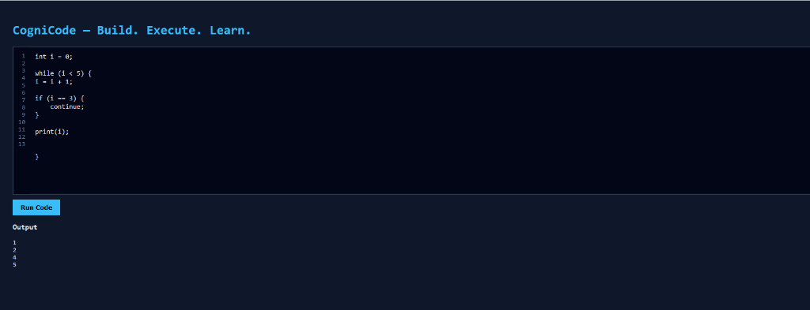
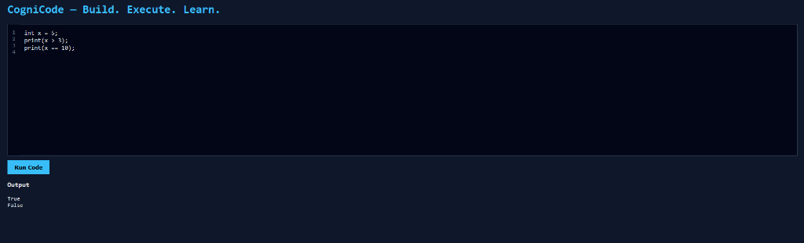

# CogniCode 🚀  
**Build. Execute. Learn.**

CogniCode is a **language-agnostic educational compiler and execution engine** designed to help learners and developers understand how programming languages work internally — from source code to execution.

Instead of targeting a specific real-world language, CogniCode focuses on **core compiler concepts** such as lexical analysis, parsing, abstract syntax trees, semantic checks, and interpretation.

---

## 📸 Screenshots




---

## ✨ Features

- 🧠 Custom-designed programming language (C-like syntax)
- 🔍 Lexer (tokenization)
- 🌳 Parser with full grammar & precedence
- 🧩 Abstract Syntax Tree (AST)
- ✅ Semantic analysis (basic checks)
- ▶ Interpreter-based execution
- 🔁 Control flow support:
  - `if / else`
  - `while`
  - `break`, `continue`
- 🔢 Arithmetic & logical expressions
- 🧪 Boolean logic (`&&`, `||`, `!`)
- 📍 Line-numbered error reporting
- 🌐 Web-based IDE (Frontend + FastAPI backend)

---

## 🛠 Tech Stack

| Layer | Technology |
|------|-----------|
| Backend | Python |
| Compiler | Custom (Lexer, Parser, AST, Interpreter) |
| API | FastAPI |
| Frontend | HTML, CSS, JavaScript |
| Runtime | Interpreter (AST traversal) |

---

## ▶ How to Run

### 1️⃣ Create Virtual Environment
```bash
python -m venv venv
```

### 2️⃣ Activate Virtual Environment
**Windows:**
```powershell
venv\Scripts\activate
```

**Linux / macOS:**
```bash
source venv/bin/activate
```

### 3️⃣ Start Backend
```bash
uvicorn backend.main:app --reload
```

### 4️⃣ Open Frontend
Open `frontend/index.html` in your browser.
